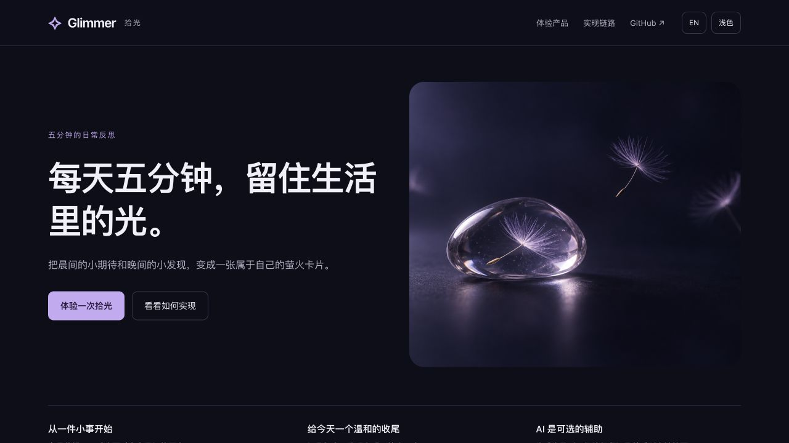
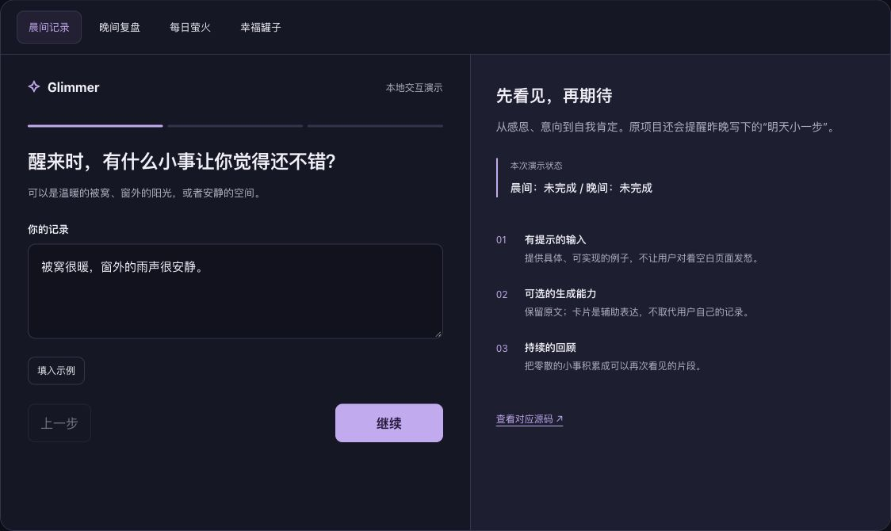
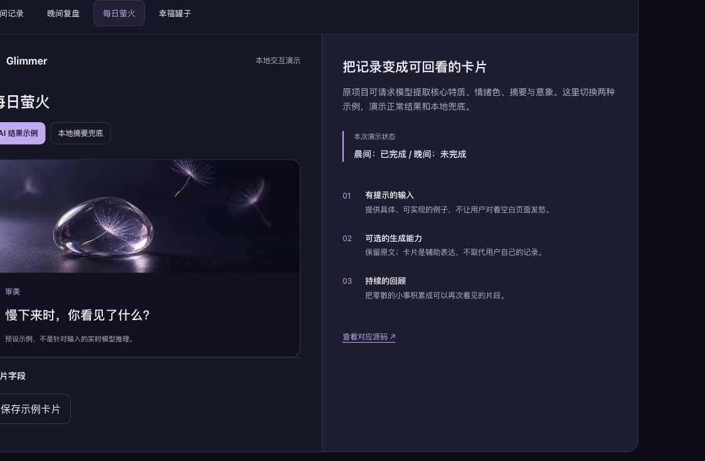
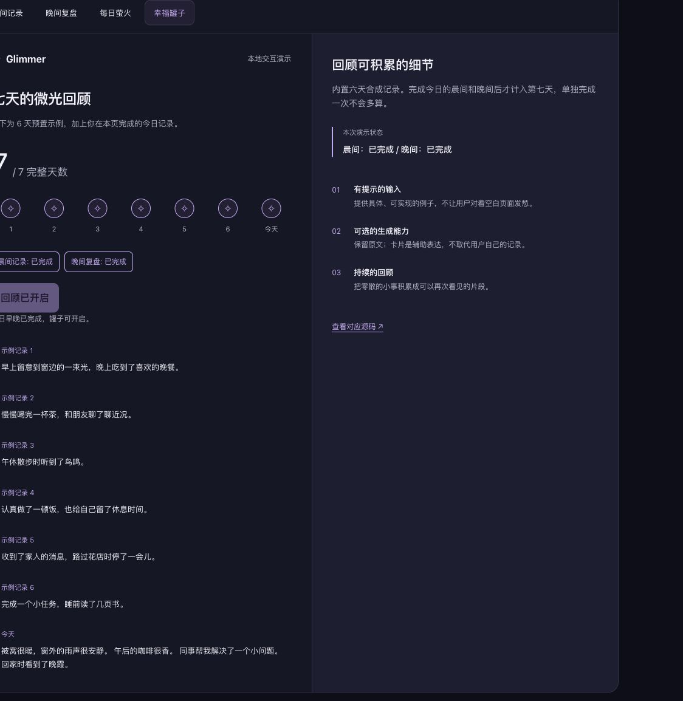
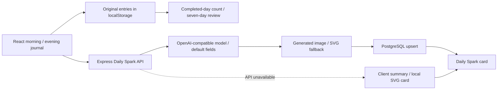

# Glimmer · 拾光

[English](README.en.md) · [简体中文](README.md)

**Five minutes a day to notice the small things worth keeping.**

Glimmer is a daily reflection app prototype with guided morning and evening journals, optional AI-assisted **Daily Spark** cards, and a **Happiness Jar** for reviewing seven completed days. The repository includes a React frontend, a Node.js/Express API, PostgreSQL card storage, and a Capacitor iOS project.

[Try the interactive demo](#interactive-demo) · [Product flow](#product-flow) · [Architecture](#architecture) · [Run locally](#run-locally)



## Why I built it

A blank journal can be hard to start. Glimmer breaks reflection into small, concrete questions: something pleasant you noticed, something to look forward to, and moments you want to remember at the end of the day.

The product combines my psychology background with product design and full-stack development. I independently designed and built the app and released an iOS beta. The main design choices are guided input, gentle reflection, and optional AI support: original entries remain available locally, and cards have fallbacks when generation is unavailable.

## Interactive demo

[Download the standalone HTML demo](https://raw.githubusercontent.com/whitesungun876/Glimmer/main/docs/demo/index.html), save it as `index.html`, and open it in a browser. No installation, account, or API key is needed. GitHub's file preview does not execute the HTML.

Alternatively, clone the repository and serve the demo from its root:

```bash
python3 -m http.server 8080 --bind 127.0.0.1 --directory docs/demo
```

Open <http://localhost:8080> and follow this flow:

1. Answer the three morning prompts, or use the sample-input button.
2. View a Daily Spark, switch between a preset AI example and a local summary, and download an SVG card.
3. Complete the evening reflection and open the Happiness Jar to review seven days.
4. Explore the implementation links. The demo supports English/Chinese and light/dark themes.

**Demo scope:** The screenshots below come from this standalone HTML demo, rather than the original React app. The six historical days are synthetic examples, and the AI cards are preset outputs with no live model calls. Demo inputs stay in page memory and disappear on refresh. The concept illustrations are generated assets. The demo does not establish the availability of a deployed backend or database.

## Product flow

### Morning and evening reflection

The morning flow asks users to notice something good, name a small anticipation, and choose an affirmation. The evening flow records three good things, one discovery, and an optional intention for tomorrow.



Source: [MorningRoutine.jsx](src/components/MainApp/MorningRoutine.jsx) · [EveningRoutine.jsx](src/components/MainApp/EveningRoutine.jsx)

### Daily Spark cards

The API sends journal text to an OpenAI-compatible model and requests four JSON fields: `core_trait`, `mood_color_hex`, `summary_sentence`, and `abstract_symbol_prompt`. It then attempts image generation and stores the card in PostgreSQL.



The failure paths are explicit:

- Missing model credentials, a failed model request, or unparseable JSON produces default card fields on the server.
- Failed image generation produces an SVG card.
- An unavailable frontend API request produces a local summary and SVG card from the original entry.

Morning and evening entries are saved locally before card generation. In the current React flow, the card appears after evening completion and can combine that day's morning and evening text. Generated cards supplement the original record.

Source: [dailySparkLLM.js](server/services/dailySparkLLM.js) · [dailySpark.js](server/routes/dailySpark.js) · [dailySparkFallback.js](src/utils/dailySparkFallback.js)

### Happiness Jar

A date counts as complete only when both its morning and evening entries exist. Each seven completed days form a review cycle; they do not have to be consecutive. Two submissions on one date count as one completed day.



Source: [achievementHelpers.js](src/utils/achievementHelpers.js) · [HappinessJar.jsx](src/components/Achievement/HappinessJar.jsx)

## Architecture



| Layer | Implementation | Source |
| --- | --- | --- |
| Product interface | React 18, CSS, guided input and review | [src/components](src/components) |
| Original journal records | Browser localStorage, keyed by date and morning/evening period | [aiHelpers.js](src/utils/aiHelpers.js) |
| Backend | Node.js and Express | [server/index.js](server/index.js) |
| AI cards | OpenAI-compatible requests, JSON parsing, default fields | [dailySparkLLM.js](server/services/dailySparkLLM.js) |
| Card persistence | PostgreSQL upsert keyed by user, entry date, and entry type | [dailySparkDb.js](server/db/dailySparkDb.js) |
| Images and sharing | Image generation, SVG fallback, html2canvas, QR components | [DailySpark](src/components/DailySpark) · [Share](src/components/Share) |
| iOS | Capacitor WebView project | [ios](ios) · [IOS_SETUP.md](IOS_SETUP.md) |

Example card fields:

```json
{
  "core_trait": "审美",
  "mood_color_hex": "#BA94FF",
  "summary_sentence": "慢下来时，你看见了什么？",
  "abstract_symbol_prompt": "a small seed held in clear glass, soft lavender light"
}
```

These illustrate the response shape. The current model prompt and card copy are primarily Chinese; the standalone demo includes English. Generated labels and summaries are reflection prompts, with no validated psychological assessment or wellbeing outcome claimed.

## Run locally

### Frontend

Install Node.js and npm, then run:

```bash
git clone https://github.com/whitesungun876/Glimmer.git
cd Glimmer
npm install
npm start
```

Open <http://localhost:3000>. Basic journal records stay in the current browser's localStorage. Daily Spark uses the client fallback when the API is unavailable.

### Optional backend and live model calls

Use a Node.js version that supports built-in `fetch` and `node --watch`. From the repository root:

```bash
cd server
npm install
cp .env.example .env
```

Configure `server/.env` with a PostgreSQL connection and the credentials for your chosen model provider. In the frontend's root `.env`, set:

```dotenv
REACT_APP_API_URL=http://localhost:4000
```

| Server variable | Purpose |
| --- | --- |
| `DATABASE_URL` | PostgreSQL connection; required by Daily Spark API endpoints |
| `OPENAI_API_KEY` or `DASHSCOPE_API_KEY` | Model credentials |
| `OPENAI_BASE_URL` or `DASHSCOPE_BASE_URL` | OpenAI-compatible endpoint |
| `OPENAI_MODEL` or `DASHSCOPE_MODEL` | Model identifier; explicitly choose a compatible model for DashScope |
| `PORT` | API port; defaults to `4000` |

Run `npm run dev` from `server`. Startup attempts to initialise the Daily Spark table. Without `DATABASE_URL`, Daily Spark endpoints return `503`; a valid database is needed for server-side persistence.

**Local API connection:** Ports `3000` and `4000` are different origins. The current Express entry point does not configure CORS, so direct browser requests need a suitable same-origin proxy or CORS configuration. Until that connection is configured, the UI can use its local card fallback.

The current [server/package.json](server/package.json) runs the JavaScript entry point `index.js` with `npm start` or `npm run dev`. Some notes in [server/README.md](server/README.md) describe an earlier TypeScript setup; use the current package scripts for startup commands.

Keep real credentials out of Git. Credentials for this Daily Spark backend flow belong in the server environment.

### Web build and iOS project

From the repository root:

```bash
npm run build
npx cap sync ios
```

Open `ios/App/App.xcworkspace` in Xcode. See [IOS_SETUP.md](IOS_SETUP.md) for configuration and device setup. The iOS beta is a development milestone; this guide does not provide a public App Store listing or beta-install invitation.

## Scope and further documentation

The repository also contains invitation, sharing, resonance, and voice-input code. This guide focuses on journaling, cards, and review. It presents the product and implementation, without claiming real-user scale, measured model quality, or clinical effectiveness. Source code and demo screenshots do not prove that every hosted integration is currently running.

| Document | Topic |
| --- | --- |
| [ENV_SETUP.md](ENV_SETUP.md) | Environment configuration |
| [server/README.md](server/README.md) | Backend concepts and database notes |
| [ACHIEVEMENT_SYSTEM.md](ACHIEVEMENT_SYSTEM.md) | Completed days and Happiness Jar |
| [AI_INTEGRATION.md](AI_INTEGRATION.md) | AI integration notes |
| [IOS_SETUP.md](IOS_SETUP.md) | iOS project setup |

The standalone demo's source links are pinned to original project commit `2bc4f94`. Relative links in this guide point to the current repository.
