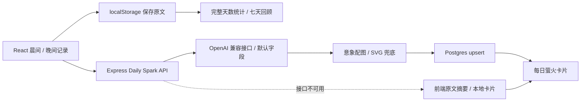

# Glimmer · 拾光

**每天五分钟，留住生活里的光。**

Glimmer 是一个日常反思产品原型：用具体的问题帮助用户完成晨间记录和晚间复盘，将记录整理成可回看的「每日萤火」，再通过七天「幸福罐子」积累生活中的小事。

*A five-minute daily reflection prototype with guided journaling, optional AI-generated Spark cards and seven-day reviews.*

[体验交互演示](#交互演示) · [看看怎么用](#从记录到回顾) · [技术实现](#技术实现) · [本地运行](#本地运行)


## 为什么做这个产品

面对空白日记，人常常不知道从哪里开始。Glimmer 把「写一篇日记」拆成几个可以回答的小问题：醒来时有什么小事还不错、今天有什么期待、晚上有哪些值得留下的瞬间。

产品围绕三个选择展开：用具体提示降低开始的门槛；以不带评判的问题帮助复盘；让 AI 成为可选的表达辅助，在生成不可用时仍保留记录和本地卡片。

## 交互演示

[下载独立 HTML](https://raw.githubusercontent.com/whitesungun876/Glimmer/main/docs/demo/index.html)，保存为 `index.html` 后用浏览器打开，即可体验，无需安装、登录或 API 密钥。GitHub 文件预览不会直接运行 HTML。

也可以克隆仓库后，在根目录启动静态服务：

```bash
python3 -m http.server 8080 --bind 127.0.0.1 --directory docs/demo
```

访问 <http://localhost:8080>。推荐按下面的顺序体验：

1. 完成晨间的三个问题，可点击「填入示例」。
2. 查看「每日萤火」，切换 AI 示例与本地摘要，下载 SVG 卡片。
3. 完成晚间复盘，再开启「幸福罐子」查看七天记录。
4. 点击「实现链路」中的模块，查看对应源码。右上角可切换中英文与深浅主题。

**演示说明：** 本页截图来自这个独立 HTML，展示核心流程与设计思路，并非原 React 应用的运行截图。六天历史记录是合成示例；AI 输出为预设卡片，不调用真实模型；输入只存在于页面内存，刷新即清除。概念配图为生成素材。

## 从记录到回顾

### 1. 晨间：先看见，再期待

用三个问题开启一天：看见一件小美好、留一个小期待、选择一句自我肯定。晚间则记录三件好事、一个发现和明天的一件小事；明日意向允许留白。


实现入口：[MorningRoutine.jsx](src/components/MainApp/MorningRoutine.jsx) · [EveningRoutine.jsx](src/components/MainApp/EveningRoutine.jsx)

### 2. 每日萤火：把文字变成可回看的卡片

原项目的 Daily Spark 后端通过 OpenAI 兼容接口提取核心特质、情绪色、摘要句和意象描述，再尝试生成配图。卡片把一次记录变成可以回看或分享的片段。


生成路径有两层兜底：后端模型请求或解析失败时使用默认字段，配图失败时使用 SVG；前端接口不可用时，从原文提取摘要并构建本地卡片。记录本身先保存在本地，生成能力不会替代原文。

实现入口：[dailySparkLLM.js](server/services/dailySparkLLM.js) · [dailySpark.js](server/routes/dailySpark.js) · [dailySparkFallback.js](src/utils/dailySparkFallback.js)

### 3. 幸福罐子：让小事逐渐积累

同一天的晨间和晚间都完成，才计入一个完整天数。每七个完整天数形成一个回顾周期，避免把同一天的两次提交算成两天。这里的七天是累计完整天数，不要求连续七天。


实现入口：[achievementHelpers.js](src/utils/achievementHelpers.js) · [HappinessJar.jsx](src/components/Achievement/HappinessJar.jsx)

## 技术实现



| 层级 | 实现 | 关键入口 |
| --- | --- | --- |
| 产品界面 | React 18、CSS、分步输入与回顾 | [src/components](src/components) |
| 本地记录 | 按日期、时段写入 localStorage | [aiHelpers.js](src/utils/aiHelpers.js) |
| 后端 API | Node.js、Express | [server/index.js](server/index.js) |
| AI 摘要 | OpenAI 兼容接口、JSON 输出请求与解析兜底 | [dailySparkLLM.js](server/services/dailySparkLLM.js) |
| 卡片持久化 | Postgres，以用户、日期、时段为唯一组合进行 upsert | [dailySparkDb.js](server/db/dailySparkDb.js) |
| 图片与分享 | 图像生成、SVG 兜底、html2canvas、二维码组件 | [DailySpark](src/components/DailySpark) · [Share](src/components/Share) |
| 移动端工程 | Capacitor iOS WebView | [ios](ios) · [IOS_SETUP.md](IOS_SETUP.md) |

Daily Spark 的模型输出包含四个字段，便于前端渲染：

```json
{
  "core_trait": "审美",
  "mood_color_hex": "#BA94FF",
  "summary_sentence": "慢下来时，你看见了什么？",
  "abstract_symbol_prompt": "a small seed held in clear glass, soft lavender light"
}
```

上面是展示字段的示例；后端将意象描述用于配图，并保存卡片字段。它不是心理诊断，也不是经过验证的效果指标。

## 本地运行

### React 前端

准备 Node.js 与 npm，在仓库根目录执行：

```bash
git clone https://github.com/whitesungun876/Glimmer.git
cd Glimmer
npm install
npm start
```

打开 <http://localhost:3000>。基础记录保存在当前浏览器的 localStorage；未配置后端时，Daily Spark 可走前端本地兜底。

### 可选后端与真实 AI

```bash
cd server
npm install
cp .env.example .env
```

编辑 `server/.env`，配置 `DATABASE_URL` 与所选模型服务的凭据，并在根目录 `.env` 中设置 `REACT_APP_API_URL=http://localhost:4000`。不要将真实密钥提交到仓库；Daily Spark 后端模型凭据放在服务端环境变量中。

| 配置 | 用途 |
| --- | --- |
| `DATABASE_URL` | Postgres 连接；Daily Spark 生成与持久化接口需要它 |
| `OPENAI_API_KEY` 或 `DASHSCOPE_API_KEY` | 服务端模型凭据 |
| `OPENAI_BASE_URL` / `DASHSCOPE_BASE_URL` | OpenAI 兼容接口地址 |
| `OPENAI_MODEL` / `DASHSCOPE_MODEL` | 模型名称；使用 DashScope 时请显式指定兼容模型 |
| `REACT_APP_API_URL` | 前端使用的 API 根地址 |

在 `server` 目录执行 `npm run dev` 启动 API。服务启动时尝试初始化 Daily Spark 表；其他功能的数据库配置参考 [server/README.md](server/README.md)。未配置数据库时，Daily Spark API 返回 `503`。

### 构建与 iOS

```bash
# 在仓库根目录执行
npm run build
npx cap sync ios
```

用 Xcode 打开 `ios/App/App.xcworkspace`。完整配置步骤见 [IOS_SETUP.md](IOS_SETUP.md)。

## 项目边界与文档

仓库还包含邀请、共鸣、分享和语音输入相关代码，这份演示聚焦记录、卡片与回顾。当前定位为产品与工程原型；README 不声明真实用户规模、模型质量评估结果或心理健康效果。

| 文档 | 内容 |
| --- | --- |
| [ENV_SETUP.md](ENV_SETUP.md) | 环境变量说明 |
| [server/README.md](server/README.md) | 后端接口与数据库 |
| [ACHIEVEMENT_SYSTEM.md](ACHIEVEMENT_SYSTEM.md) | 完整天数与幸福罐子 |
| [AI_INTEGRATION.md](AI_INTEGRATION.md) | AI 集成说明 |
| [IOS_SETUP.md](IOS_SETUP.md) | iOS 工程运行 |

展示页的源码链接固定到原项目版本 `2bc4f94`，便于对照；README 中的相对链接指向当前仓库。
